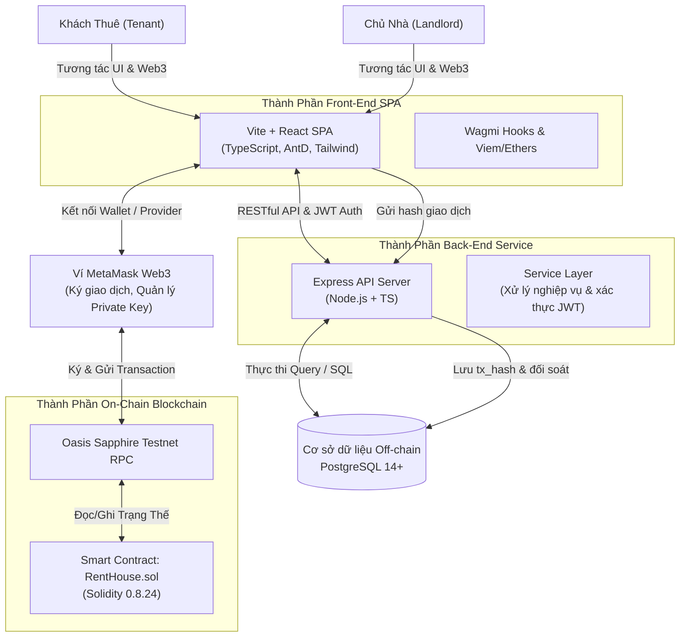
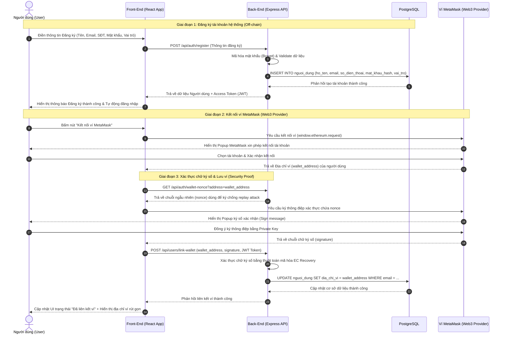
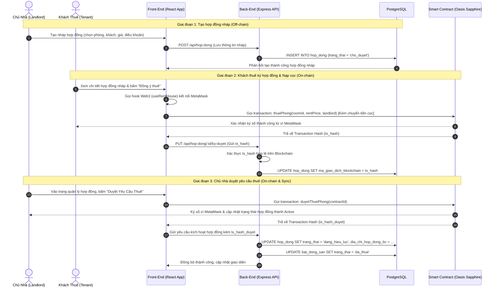
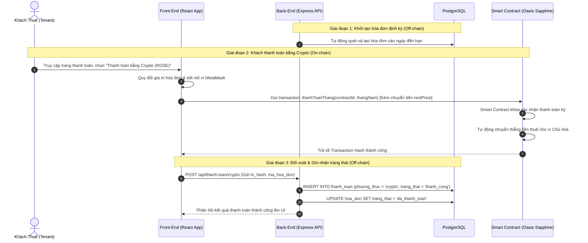

# Tài Liệu Kiến Trúc Hệ Thống - dApp Quản Lý Thuê Nhà

> Môn học: Ứng dụng phi tập trung (dApp)
> Trường: Đại học Giao thông Vận tải
> Hệ thống: Cấu trúc Hybrid (PostgreSQL + EVM Blockchain Oasis Sapphire)
> File mô tả: kien-truc-he-thong.md

---

## 1. Tổng Quan Kiến Trúc Hệ Thống (Hybrid Architecture)

Hệ thống **dApp Quản Lý Thuê Nhà** được thiết kế theo mô hình **Kiến trúc Hybrid (Lai)**. Mô hình này kết hợp ưu điểm của cơ sở dữ liệu truyền thống (Off-chain) để xử lý dữ liệu nghiệp vụ phức tạp với tốc độ cao, và mạng lưới Chuỗi khối (On-chain) để lưu vết tài chính, hợp đồng pháp lý một cách minh bạch, bảo mật và bất biến.



### Nguyên tắc phân chia On-chain & Off-chain:
* **Dữ liệu Off-chain (PostgreSQL):** Lưu trữ thông tin tài khoản người dùng, hình ảnh CCCD, thông tin chi tiết các tòa nhà, phòng trọ, danh mục dịch vụ (điện, nước, internet), lịch sử sự cố và các thông báo hệ thống. Điều này giúp hệ thống phản hồi cực nhanh, hỗ trợ tìm kiếm và lọc dữ liệu nghiệp vụ hiệu quả.
* **Dữ liệu On-chain (Oasis Sapphire Blockchain):** Lưu trữ các thông tin liên quan đến tính pháp lý và tài chính cốt lõi:
  * Trạng thái và điều khoản hợp đồng thuê phòng (Mã phòng, ví chủ nhà, ví người thuê, giá thuê, tiền cọc).
  * Lịch sử thanh toán tiền thuê phòng hàng tháng.
  * Trạng thái giữ và hoàn trả tiền đặt cọc phòng.

---

## 2. Kiến Trúc Front-End (FE)

Thành phần Front-End được xây dựng như một ứng dụng đơn trang (**Single Page Application - SPA**) hiện đại, bảo mật cao và tối ưu trải nghiệm người dùng.

### 2.1. Ngăn công nghệ (Tech Stack)
* **Framework chính:** `React 19` sử dụng công cụ build nhanh `Vite` giúp khởi động và phát triển tối ưu nhất.
* **Ngôn ngữ:** `TypeScript` giúp kiểm soát chặt chẽ kiểu dữ liệu, giảm thiểu lỗi runtime.
* **Thư viện UI:** `Ant Design (Antd)` cung cấp bộ linh kiện (UI Components) chuyên nghiệp, đồng bộ; kết hợp với `TailwindCSS` để tuỳ chỉnh giao diện linh hoạt, hiện đại.
* **Web3 / Blockchain Integration:**
  * `Wagmi (v3)`: Thư viện React Hooks tối ưu hỗ trợ kết nối ví, quản lý trạng thái mạng lưới và tương tác với Smart Contract.
  * `Viem`: Thư viện lõi thay thế cho Web3.js / Ethers.js giúp thực thi các truy vấn blockchain với hiệu năng vượt trội và dung lượng bundle cực nhẹ.
  * `Ethers.js (v6)`: Sử dụng hỗ trợ xử lý số lớn (BigInt), đối soát định dạng địa chỉ ví hoặc ký dữ liệu khi cần.

### 2.2. Cấu trúc tổ chức thư mục Frontend
```
apps/frontend/src/
├── assets/          # Tài nguyên tĩnh (ảnh, logo, icons)
├── components/      # Các UI component dùng chung (Modal, Navbar, Sidebar, Card)
├── hooks/           # Các Custom Hooks xử lý Web3 và gọi API (useRentHouse.ts, useAuth.ts)
├── lib/             # Các thư viện cấu hình dùng chung (utils.ts, axios.ts)
├── pages/           # Các trang giao diện chính:
│   ├── Home.tsx         # Trang chủ giới thiệu, tìm kiếm phòng
│   ├── Login.tsx        # Trang đăng nhập kết hợp Email & Ví MetaMask
│   ├── Rooms.tsx        # Trang danh sách phòng cho thuê của chủ nhà
│   ├── RoomDetail.tsx   # Trang chi tiết phòng và gửi yêu cầu thuê
│   ├── ManageRoom.tsx   # Trang quản lý phòng dành cho chủ nhà
│   ├── Contracts.tsx    # Trang danh sách, ký duyệt và theo dõi hợp đồng
│   └── PayRent.tsx      # Trang quản lý hóa đơn và thanh toán
├── wagmi.ts         # File cấu hình kết nối mạng Oasis Sapphire Testnet
└── App.tsx          # Điểm đầu vào định tuyến chính (React Router Dom)
```

---

## 3. Kiến Trúc Back-End (BE) & Cơ Sở Dữ Liệu (Database)

Back-End đóng vai trò là API Gateway xử lý toàn bộ logic nghiệp vụ truyền thống, kiểm soát truy cập (Authentication/Authorization) và lưu giữ lịch sử đồng bộ.

### 3.1. Ngăn công nghệ (Tech Stack)
* **Runtime Environment:** `Node.js` kết hợp với Framework web `Express`.
* **Ngôn ngữ:** `TypeScript` đồng bộ định nghĩa kiểu dữ liệu với Front-End.
* **Cơ sở dữ liệu:** `PostgreSQL 14+` - Cơ sở dữ liệu quan hệ mạnh mẽ, hỗ trợ kiểu dữ liệu `JSONB` linh hoạt để lưu giữ các trường dữ liệu tùy biến như tiện nghi phòng trọ (`tien_nghi`) hoặc hình ảnh báo cáo sự cố (`hinh_anh`).
* **ORM / Database Client:** `pg` (node-postgres) thực hiện các câu lệnh SQL thuần được tối ưu hóa bằng các Index trường khóa ngoại, đảm bảo hiệu suất tối đa.
* **Bảo mật:** `jsonwebtoken` (JWT) để xác thực người dùng và phân quyền chi tiết (RBAC - Role-Based Access Control).

### 3.2. Cấu trúc đồng bộ hóa cơ sở dữ liệu (Database Schema)
Các bảng dữ liệu trong PostgreSQL được liên kết chặt chẽ với Blockchain thông qua các trường đặc thù:
* **[nguoi_dung](file:///c:/Users/Admin/Desktop/UTC/dApp/dApp-QuanLyThueNha/database/schema.sql#L9-L26):** Lưu trường `dia_chi_vi` (`VARCHAR(42) UNIQUE`) để định danh tài khoản Web3 của Khách thuê và Chủ nhà.
* **[hop_dong](file:///c:/Users/Admin/Desktop/UTC/dApp/dApp-QuanLyThueNha/database/schema.sql#L89-L120):** Lưu trường `ma_giao_dich_blockchain` (mã hash giao dịch tạo/ký hợp đồng) và `dia_chi_hop_dong_bc` để liên kết trực tiếp với dữ liệu on-chain trong trường hợp cần đối soát.
* **[thanh_toan](file:///c:/Users/Admin/Desktop/UTC/dApp/dApp-QuanLyThueNha/database/schema.sql#L211-L230):** Lưu `ma_giao_dich_blockchain` khi khách thanh toán bằng đồng crypto ROSE (TEST) giúp xác minh giao dịch đã thành công trên chuỗi khối.

---

## 4. Kiến Trúc Smart Contract (On-Chain)

Thành phần Smart Contract chịu trách nhiệm thực thi các điều khoản thỏa thuận tự động giữa Khách thuê và Chủ nhà mà không cần bên thứ ba làm trung gian tin cậy.

### 4.1. Thông số kỹ thuật
* **Ngôn ngữ lập trình:** Solidity `>=0.8.0 <0.9.0` (Biên dịch chính thức trên `0.8.24`).
* **Framework phát triển:** `Hardhat` để biên dịch, kiểm thử cục bộ và viết script triển khai.
* **Mạng lưới triển khai:** **Oasis Sapphire Testnet**.
  * *Lý do chọn Oasis Sapphire:* Đây là một **Confidential EVM paratime** hàng đầu. Nó hỗ trợ mã hóa trạng thái hợp đồng (State Privacy). Các dữ liệu nhạy cảm hoặc giao dịch gọi hàm sẽ không bị công khai hoàn toàn trên explorer, bảo vệ quyền riêng tư tuyệt đối cho khách thuê và chủ nhà mà vẫn duy trì tính bất biến của Blockchain.

### 4.2. Thiết kế dữ liệu và các hàm lõi trong `RentHouse.sol`

Hợp đồng [RentHouse.sol](file:///c:/Users/Admin/Desktop/UTC/dApp/dApp-QuanLyThueNha/packages/contracts/contracts/RentHouse.sol) được thiết kế theo hướng đa chủ sở hữu (Multi-landlord Platform), cho phép bất kỳ cặp chủ nhà - khách thuê nào cũng có thể thiết lập giao dịch thông qua cấu trúc dữ liệu sau:

```solidity
enum Status { Pending, Active, Ended, Rejected, Evicted }

struct RentalContract {
    uint id;                    // Mã định danh hợp đồng tăng dần
    uint roomId;                // Mã phòng trọ (tham chiếu ID off-chain)
    address landlord;           // Địa chỉ ví chủ nhà (nhận tiền thuê/cọc)
    address tenant;             // Địa chỉ ví khách thuê
    uint rentPrice;             // Giá thuê phòng mỗi tháng (tính bằng Wei)
    uint deposit;               // Tiền cọc phòng (được khóa trong contract)
    Status status;              // Trạng thái hợp đồng
    uint nextPaymentDueDate;    // Hạn thanh toán kỳ tiếp theo
}
```

#### Các hàm chức năng chính:
1. **`thuePhong(uint _roomId, uint _rentPrice, address _landlord) public payable`**: Khách thuê gửi yêu cầu thuê kèm theo số tiền gửi trực tiếp vào Smart Contract đóng vai trò làm tiền đặt cọc (`deposit`). Trạng thái hợp đồng ban đầu là `Pending`.
2. **`duyetThuePhong(uint _contractId) public onlyContractLandlord`**: Chủ nhà phê duyệt yêu cầu. Trạng thái hợp đồng chuyển sang `Active`. Hạn thanh toán tiếp theo được kích hoạt tự động.
3. **`tuChoiThuePhong(uint _contractId) public onlyContractLandlord`**: Chủ nhà từ chối yêu cầu thuê. Smart Contract tự động hoàn trả 100% tiền đặt cọc (`deposit`) về ví của Khách thuê ngay lập tức. Trạng thái chuyển sang `Rejected`.
4. **`thanhToanThang(uint _contractId, uint _thangNam) public payable`**: Khách thuê chuyển tiền thuê hàng tháng. Smart Contract kiểm tra số tiền khớp với `rentPrice` và tự động chuyển khoản thẳng về ví của Chủ nhà, đồng thời cập nhật `nextPaymentDueDate` thêm 30 ngày và đánh dấu tháng đó đã thanh toán.
5. **`traPhong(uint _contractId) public`**: Cả hai bên có quyền kích hoạt khi muốn kết thúc hợp đồng bình thường. Smart Contract sẽ hoàn trả tiền cọc (`deposit`) được giữ ban đầu về cho Khách thuê một cách an toàn. Trạng thái chuyển sang `Ended`.
6. **`thuHoiCocDoViPham(uint _contractId) public onlyContractLandlord`**: Nếu Khách thuê trễ hạn thanh toán vượt quá thời gian gia hạn, Chủ nhà có quyền gọi hàm này để tịch thu toàn bộ tiền cọc (`deposit`) chuyển về ví của mình để bù đắp thiệt hại, đồng thời trục xuất khách thuê (`Evicted`).

---

## 5. Các Luồng Nghiệp Vụ Tương Tác Giữa Các Thành Phần

### 5.1. Luồng 1: Đăng ký tài khoản và kết nối liên kết ví MetaMask

Luồng này mô tả quá trình một người dùng mới (Chủ nhà hoặc Khách thuê) tạo tài khoản nghiệp vụ trên hệ thống bằng phương thức truyền thống (Email & Mật khẩu), sau đó thực hiện liên kết địa chỉ ví Web3 (MetaMask) một cách an toàn thông qua chữ ký số mã hóa mã bảo mật.



---

### 5.2. Luồng 2: Tạo và ký hợp đồng thuê nhà (On-chain & Off-chain)

Luồng này mô tả cách Chủ nhà tạo hợp đồng nháp lưu ở cơ sở dữ liệu Off-chain, sau đó Khách thuê phê duyệt bằng cách ký giao dịch nạp tiền đặt cọc trực tiếp lên Smart Contract (On-chain), và cuối cùng Chủ nhà xác nhận giao dịch để kích hoạt trạng thái hiệu lực.



---

### 5.3. Luồng 3: Thanh toán tiền thuê hàng tháng

Luồng này mô tả cách hóa đơn hàng tháng được tạo, Khách thuê thực hiện chuyển tiền thuê trực tiếp qua Smart Contract đến địa chỉ ví của Chủ nhà, và hệ thống tự động ghi nhận thanh toán hoàn tất.



---

## 6. Hướng Phát Triển Tương Lai (Future Roadmap)

Để nâng cao khả năng thương mại hóa, tính thực tế và tính bảo mật của hệ thống **dApp Quản Lý Thuê Nhà**, các hướng phát triển tương lai sẽ tập trung vào các điểm chính sau:

### 6.1. Bảo mật dữ liệu nâng cao trên Oasis Sapphire (Confidentiality)
* **Mã hóa minh chứng danh tính (CCCD/Passport):** Sử dụng các thư viện mã hóa bất đối xứng để mã hóa hình ảnh và số CCCD của người dùng trước khi upload lên lưu trữ phi tập trung (ví dụ: IPFS). Key giải mã sẽ được quản lý nghiêm ngặt on-chain thông qua các hàm bảo mật của Oasis Sapphire, chỉ cho phép chủ nhà đã được phê duyệt truy cập để kiểm tra.
* **Mã hóa chi tiết giá cả và chỉ số:** Cho phép tùy chọn ẩn thông tin giá thuê hoặc các thỏa thuận đặc biệt trên hợp đồng, chỉ hiển thị cho khách thuê và chủ nhà thông qua mã hóa luồng dữ liệu (State Encryption) của chuỗi Sapphire.

### 6.2. Nâng cấp cơ chế thanh toán và Quản lý tài chính
* **Tích hợp các stablecoin (USDT, USDC):** Giảm thiểu rủi ro biến động giá của đồng ROSE bằng cách cho phép khách thuê thanh toán tiền nhà thông qua các đồng stablecoin được bảo chứng, trong khi phí gas vẫn sử dụng ROSE với mức phí cực kỳ thấp.
* **Triển khai Trừu tượng hóa tài khoản (Account Abstraction - ERC-4337):** Hỗ trợ tính năng thanh toán tự động định kỳ (**Recurring Payments**). Khách thuê chỉ cần ủy quyền một lần, Smart Contract sẽ tự động trích xuất tiền thuê hàng tháng từ ví của họ khi đến hạn mà không cần phải xác nhận giao dịch MetaMask thủ công mỗi tháng.

### 6.3. Giải quyết tranh chấp phi tập trung (Decentralized Dispute Resolution)
* **Hợp đồng giữ cọc thông minh (Escrow Contract):** Thiết lập cơ chế khóa tiền đặt cọc có sự tham gia của Trọng tài. Khi kết thúc hợp đồng, nếu xảy ra tranh chấp về hư hỏng tài sản hoặc tiền cọc, số tiền cọc sẽ được xử lý thông qua cơ chế biểu quyết đa chữ ký (Multi-signature) có sự tham gia của bên thứ ba trung lập (hoặc một mô hình trọng tài phi tập trung dựa trên sự đồng thuận của cộng đồng).

### 6.4. Định danh uy tín phi tập trung (Decentralized Reputation - SBT)
* **Soulbound Tokens (SBT):** Phát hành các NFT không thể chuyển nhượng (SBT) làm minh chứng uy tín cho cả hai bên:
  * **Đối với khách thuê:** Huy hiệu "Người thuê uy tín" nếu liên tục đóng tiền nhà đúng hạn và không vi phạm điều khoản.
  * **Đối với chủ nhà:** Huy hiệu "Chủ nhà tin cậy" dựa trên số điểm đánh giá và tốc độ phản hồi, xử lý yêu cầu sửa chữa sự cố của khách thuê.

### 6.5. Tích hợp thiết bị thông minh IoT (Internet of Things)
* **Khóa thông minh (Smart Lock) kết nối Smart Contract:** Kết nối trực tiếp hệ thống IoT của căn nhà với blockchain. Khi khách thuê hoàn tất việc ký hợp đồng và gửi tiền cọc thành công on-chain, Smart Contract sẽ tự động kích hoạt quyền mở khóa cửa phòng (mã số hoặc xác thực ví Web3) cho thiết bị IoT ở thế giới thực mà không cần chủ nhà phải giao chìa khóa trực tiếp.

### 6.6. Mở rộng chuỗi chéo (Cross-chain Payment)
* **Oasis Privacy Layer (OPL):** Sử dụng công nghệ OPL hoặc các cầu nối chuỗi chéo (như Axelar, LayerZero) để cho phép người dùng từ các mạng lưới khác (như Ethereum, Arbitrum, BNB Chain) có thể dễ dàng thanh toán tiền nhà hoặc ký hợp đồng mà vẫn giữ nguyên logic bảo mật dữ liệu riêng tư chạy trên Oasis Sapphire.

---

## 7. Kết Luận
Kiến trúc Hybrid này giúp hệ thống đạt được hiệu năng tối ưu của ứng dụng Web truyền thống nhưng đồng thời thừa hưởng tính minh bạch, tính pháp lý phi tập trung của công nghệ Blockchain. Mạng lưới chuyên biệt **Oasis Sapphire** bảo vệ thông tin hợp đồng của người dùng trước các nguy cơ rò rỉ dữ liệu cá nhân trên On-chain công khai, nâng tầm hệ thống thành một dApp thuê nhà thế hệ mới, an toàn và toàn diện.
