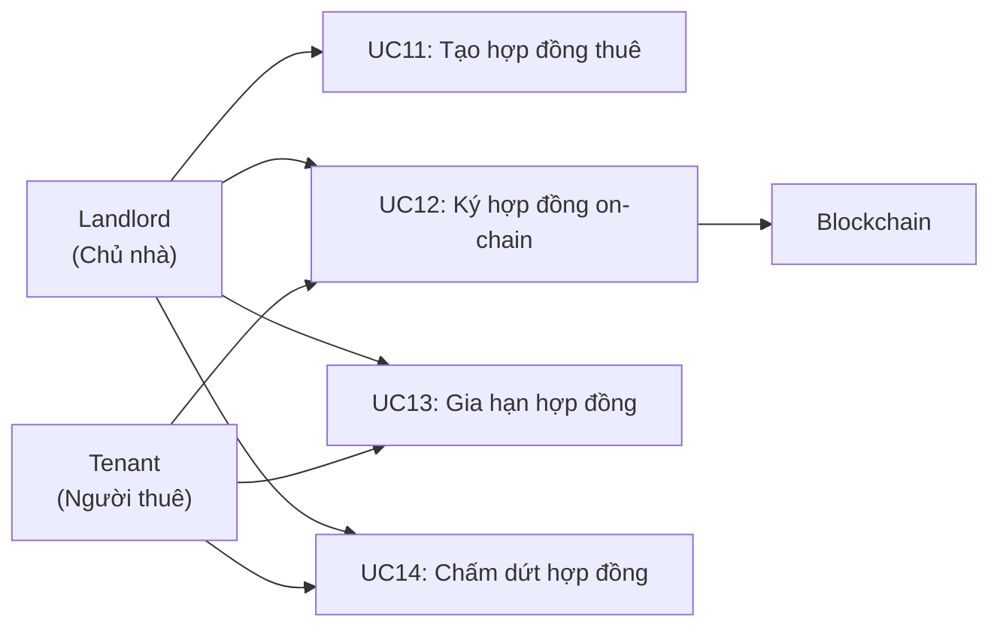
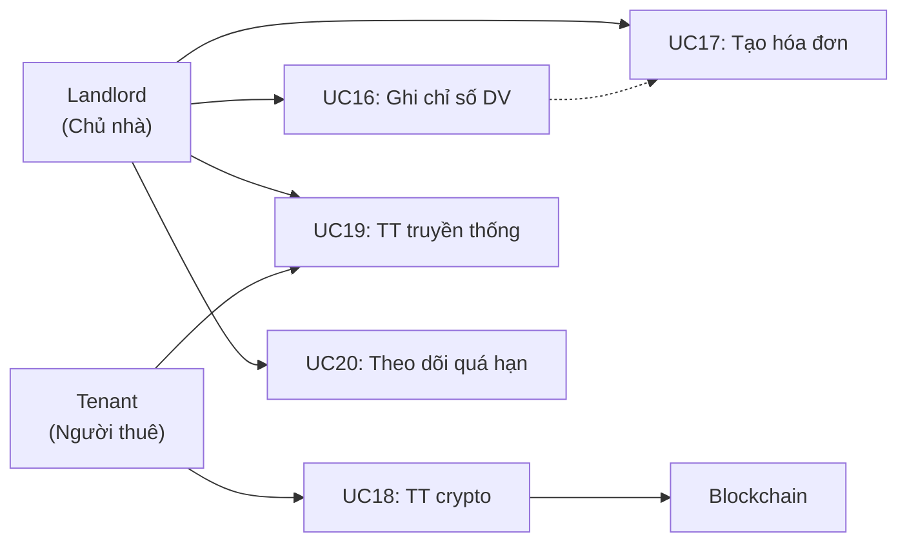

# Phân Tích Yêu Cầu - dApp Quản Lý Thuê Nhà

> Môn học: Ứng dụng phi tập trung (dApp)
> Trường: Đại học Giao thông Vận tải
> Năm học: 2025 - 2026, Học kỳ 6

---

## 1. Giới thiệu đề tài

### 1.1. Tên đề tài

**Xây dựng ứng dụng phi tập trung (dApp) quản lý thuê nhà tích hợp blockchain Ethereum**

### 1.2. Bối cảnh và lý do chọn đề tài

Thị trường cho thuê nhà tại Việt Nam đang phát triển mạnh mẽ, đặc biệt tại các thành phố lớn như Hà Nội và TP. Hồ Chí Minh. Tuy nhiên, hoạt động quản lý thuê nhà hiện tại vẫn tồn tại nhiều bất cập:

- **Quản lý thủ công**: Phần lớn chủ nhà vẫn sử dụng sổ sách, ghi chép tay để theo dõi hợp đồng, thu tiền thuê, chỉ số điện nước. Điều này dẫn đến sai sót và mất thời gian.
- **Thiếu minh bạch**: Hợp đồng thuê nhà thường chỉ tồn tại dưới dạng giấy, dễ bị thay đổi hoặc mất mát, gây tranh chấp giữa chủ nhà và người thuê.
- **Khó khăn trong thanh toán**: Thanh toán bằng tiền mặt hoặc chuyển khoản thiếu tính xác minh tự động, chủ nhà phải tự kiểm tra từng giao dịch.
- **Thiếu công cụ đánh giá**: Người thuê khó đánh giá chất lượng phòng trọ và chủ nhà trước khi ký hợp đồng.

Với sự phát triển của công nghệ blockchain, ứng dụng phi tập trung (dApp) mang đến giải pháp đảm bảo **tính minh bạch, không thể chỉnh sửa** cho hợp đồng và giao dịch thanh toán, đồng thời tận dụng cơ sở dữ liệu truyền thống (MySQL) để lưu trữ và truy vấn dữ liệu nghiệp vụ hiệu quả.

### 1.3. Mục tiêu

- Xây dựng hệ thống dApp quản lý thuê nhà trọn vẹn vòng đời: từ đăng tin, tìm phòng, ký hợp đồng, thanh toán, đến kết thúc hợp đồng.
- Tích hợp blockchain Ethereum để lưu trữ hợp đồng thuê và xác nhận thanh toán bằng cryptocurrency, đảm bảo minh bạch và bất biến.
- Sử dụng MySQL làm cơ sở dữ liệu chính cho dữ liệu nghiệp vụ (thông tin người dùng, phòng, hóa đơn, dịch vụ...).
- Cung cấp giao diện thân thiện cho cả chủ nhà và người thuê.

### 1.4. Phạm vi

Hệ thống bao gồm các module chính:

| STT | Module | Mô tả |
|-----|--------|-------|
| 1 | Quản lý người dùng | Đăng ký, đăng nhập, xác thực danh tính, liên kết ví Ethereum |
| 2 | Quản lý bất động sản | Quản lý tòa nhà, nhà trọ, chung cư và ảnh |
| 3 | Quản lý phòng cho thuê | Quản lý phòng, tiện nghi, giá, trạng thái |
| 4 | Quản lý hợp đồng | Tạo, ký (on-chain), gia hạn, chấm dứt hợp đồng |
| 5 | Quản lý dịch vụ | Điện, nước, internet, rác, giữ xe... |
| 6 | Hóa đơn & thanh toán | Tạo hóa đơn tổng hợp, thanh toán (tiền mặt / chuyển khoản / crypto) |
| 7 | Sự cố & bảo trì | Báo sự cố, theo dõi xử lý |
| 8 | Đánh giá | Đánh giá 2 chiều (người thuê - chủ nhà) |
| 9 | Thông báo | Thông báo tự động cho các sự kiện |
| 10 | Blockchain | Log giao dịch, smart contract |

---

## 2. Mô tả bài toán

### 2.1. Thực trạng

```
┌─────────────────────────────────────────────────────────────┐
│                QUẢN LÝ THUÊ NHÀ TRUYỀN THỐNG               │
├─────────────────────────────────────────────────────────────┤
│  Chủ nhà                      Người thuê                   │
│  ┌─────────────┐              ┌─────────────┐              │
│  │ Ghi sổ tay  │              │ Tìm qua     │              │
│  │ Thu tiền mặt│◄────────────►│ truyền miệng│              │
│  │ In hợp đồng │              │ Thanh toán   │              │
│  │ giấy        │              │ tiền mặt     │              │
│  └─────────────┘              └─────────────┘              │
│                                                             │
│  Vấn đề:                                                   │
│  ✗ Hợp đồng giấy dễ thất lạc, giả mạo                     │
│  ✗ Thanh toán không có bằng chứng xác thực                  │
│  ✗ Chỉ số điện nước ghi tay, dễ sai sót                    │
│  ✗ Không có kênh báo sự cố chính thức                      │
│  ✗ Không có hệ thống đánh giá uy tín                       │
└─────────────────────────────────────────────────────────────┘
```

### 2.2. Giải pháp đề xuất

Hệ thống dApp Quản lý thuê nhà sử dụng kiến trúc **hybrid** kết hợp:

- **MySQL**: Lưu trữ toàn bộ dữ liệu nghiệp vụ (thông tin người dùng, bất động sản, phòng, hóa đơn, dịch vụ, sự cố, thông báo...) phục vụ truy vấn nhanh và báo cáo.
- **Blockchain Ethereum**: Lưu trữ hợp đồng thuê nhà và xác nhận giao dịch thanh toán thông qua smart contract, đảm bảo tính minh bạch và bất biến.

```
┌─────────────────────────────────────────────────────────────┐
│                    dApp QUẢN LÝ THUÊ NHÀ                    │
├─────────────────────────────────────────────────────────────┤
│                                                             │
│  ┌──────────────────┐         ┌──────────────────┐         │
│  │    MySQL (Off)    │         │  Blockchain (On)  │         │
│  │                  │         │                  │         │
│  │ • Người dùng     │         │ • Hợp đồng thuê  │         │
│  │ • Bất động sản   │  ◄───►  │   (Smart Contract)│         │
│  │ • Phòng, dịch vụ │  tx_hash│ • Thanh toán      │         │
│  │ • Hóa đơn        │         │   crypto          │         │
│  │ • Sự cố, đánh giá│         │ • Đặt cọc         │         │
│  │ • Thông báo      │         │                  │         │
│  └──────────────────┘         └──────────────────┘         │
│                                                             │
│  Ưu điểm:                                                  │
│  ✓ Hợp đồng bất biến trên blockchain                       │
│  ✓ Thanh toán minh bạch, truy vết được                     │
│  ✓ Dữ liệu nghiệp vụ truy vấn nhanh qua MySQL             │
│  ✓ Quản lý dịch vụ, hóa đơn tự động                       │
│  ✓ Đánh giá 2 chiều, tăng uy tín                           │
└─────────────────────────────────────────────────────────────┘
```

---

## 3. Các tác nhân (Actors)

Hệ thống có **3 tác nhân người dùng** và **1 tác nhân hệ thống**:

| STT | Tác nhân | Vai trò | Mô tả |
|-----|----------|---------|-------|
| 1 | **Admin** (Quản trị viên) | admin | Quản trị toàn bộ hệ thống: phê duyệt xác thực người dùng, quản lý tài khoản, xem thống kê tổng quan |
| 2 | **Landlord** (Chủ nhà) | landlord | Đăng bất động sản và phòng cho thuê, thiết lập dịch vụ, tạo hợp đồng, xuất hóa đơn, xử lý sự cố, đánh giá người thuê |
| 3 | **Tenant** (Người thuê) | tenant | Tìm kiếm phòng, ký hợp đồng thuê, thanh toán tiền thuê và dịch vụ, báo sự cố, đánh giá phòng và chủ nhà |
| 4 | **Blockchain** (Smart Contract) | hệ thống | Nhận và lưu trữ hợp đồng thuê, xác nhận giao dịch thanh toán crypto, đảm bảo tính bất biến |

---

## 4. Yêu cầu chức năng

### 4.1. Nhóm chức năng: Quản lý người dùng

| Mã | Tên chức năng | Tác nhân | Mô tả |
|----|--------------|----------|-------|
| UC01 | Đăng ký tài khoản | Landlord, Tenant | Người dùng đăng ký với email, mật khẩu, họ tên, số điện thoại, chọn vai trò (chủ nhà / người thuê) |
| UC02 | Đăng nhập | Tất cả | Đăng nhập bằng email/mật khẩu hoặc kết nối ví MetaMask |
| UC03 | Xác thực danh tính | Tất cả, Admin | Người dùng upload ảnh CCCD (mặt trước + sau). Admin phê duyệt xác thực |
| UC04 | Liên kết ví Ethereum | Landlord, Tenant | Kết nối ví MetaMask, lưu wallet_address vào tài khoản |
| UC05 | Quản lý thông tin cá nhân | Tất cả | Cập nhật họ tên, số điện thoại, ảnh đại diện |

### 4.2. Nhóm chức năng: Quản lý bất động sản & phòng

| Mã | Tên chức năng | Tác nhân | Mô tả |
|----|--------------|----------|-------|
| UC06 | Thêm bất động sản | Landlord | Tạo mới tòa nhà/nhà trọ: tên, địa chỉ, loại, mô tả, tọa độ GPS |
| UC07 | Quản lý ảnh bất động sản | Landlord | Upload, xóa ảnh, đặt ảnh chính |
| UC08 | Thêm phòng cho thuê | Landlord | Tạo phòng trong bất động sản: số phòng, tầng, diện tích, giá thuê, tiền cọc, tiện nghi (JSON) |
| UC09 | Cập nhật trạng thái phòng | Landlord | Chuyển trạng thái phòng: available / occupied / maintenance |
| UC10 | Tìm kiếm phòng | Tenant | Tìm phòng theo thành phố, quận, khoảng giá, diện tích, tiện nghi |

### 4.3. Nhóm chức năng: Quản lý hợp đồng

| Mã | Tên chức năng | Tác nhân | Mô tả |
|----|--------------|----------|-------|
| UC11 | Tạo hợp đồng thuê | Landlord | Tạo hợp đồng: chọn phòng, người thuê, thời hạn, giá thuê, tiền cọc, ngày thanh toán, điều khoản |
| UC12 | Ký hợp đồng trên blockchain | Landlord, Tenant | Cả hai bên ký hợp đồng. Giao dịch được ghi lên smart contract, lưu tx_hash và smart_contract_address |
| UC13 | Gia hạn hợp đồng | Landlord, Tenant | Gia hạn hợp đồng đang active: cập nhật end_date, giá thuê mới (nếu thay đổi) |
| UC14 | Chấm dứt hợp đồng | Landlord, Tenant | Chấm dứt hợp đồng trước hoặc đúng hạn. Cập nhật status = terminated/expired, trả lại tiền cọc |

### 4.4. Nhóm chức năng: Quản lý dịch vụ

| Mã | Tên chức năng | Tác nhân | Mô tả |
|----|--------------|----------|-------|
| UC15 | Thiết lập dịch vụ | Landlord | Thêm/sửa/xóa dịch vụ cho bất động sản: điện (kWh), nước (m3), internet (tháng), rác, giữ xe... với đơn giá |
| UC16 | Ghi chỉ số sử dụng | Landlord | Ghi nhận chỉ số điện/nước hàng tháng cho từng hợp đồng (chỉ số cũ, chỉ số mới). Hệ thống tự tính lượng sử dụng và thành tiền |

### 4.5. Nhóm chức năng: Hóa đơn & thanh toán

| Mã | Tên chức năng | Tác nhân | Mô tả |
|----|--------------|----------|-------|
| UC17 | Tạo hóa đơn hàng tháng | Landlord | Tạo hóa đơn tổng hợp = tiền thuê + tổng tiền dịch vụ + phí khác - giảm giá. Gắn hạn thanh toán |
| UC18 | Thanh toán bằng crypto | Tenant | Thanh toán hóa đơn qua ví MetaMask. Giao dịch ghi lên blockchain, lưu tx_hash vào payments |
| UC19 | Thanh toán truyền thống | Tenant | Thanh toán bằng tiền mặt hoặc chuyển khoản ngân hàng. Chủ nhà xác nhận đã nhận tiền |
| UC20 | Theo dõi hóa đơn quá hạn | Landlord | Xem danh sách hóa đơn quá hạn (status = overdue), gửi nhắc nhở |

### 4.6. Nhóm chức năng: Sự cố & bảo trì

| Mã | Tên chức năng | Tác nhân | Mô tả |
|----|--------------|----------|-------|
| UC21 | Tạo yêu cầu sửa chữa | Tenant | Báo sự cố: tiêu đề, mô tả, phân loại (điện/nước/nội thất/thiết bị), mức ưu tiên, đính kèm ảnh |
| UC22 | Xử lý yêu cầu sửa chữa | Landlord | Xem danh sách yêu cầu, cập nhật trạng thái (đang xử lý / đã xử lý / từ chối), ghi chú xử lý |

### 4.7. Nhóm chức năng: Đánh giá

| Mã | Tên chức năng | Tác nhân | Mô tả |
|----|--------------|----------|-------|
| UC23 | Đánh giá phòng và chủ nhà | Tenant | Sau khi hết hợp đồng, người thuê đánh giá phòng (1-5 sao) và chủ nhà (1-5 sao), kèm bình luận |
| UC24 | Đánh giá người thuê | Landlord | Chủ nhà đánh giá người thuê (1-5 sao) sau khi kết thúc hợp đồng |

### 4.8. Nhóm chức năng: Thông báo & blockchain

| Mã | Tên chức năng | Tác nhân | Mô tả |
|----|--------------|----------|-------|
| UC25 | Gửi thông báo | Hệ thống | Tự động gửi thông báo khi: tạo hóa đơn, thanh toán thành công, hóa đơn quá hạn, hợp đồng sắp hết hạn, sự cố được xử lý |
| UC26 | Xem thông báo | Tất cả | Xem danh sách thông báo, đánh dấu đã đọc |
| UC27 | Xem lịch sử giao dịch blockchain | Tất cả | Xem log các giao dịch blockchain liên quan: tạo hợp đồng, thanh toán, đặt cọc, với đầy đủ tx_hash, block number, gas |

---

## 5. Yêu cầu phi chức năng

### 5.1. Bảo mật

| Yêu cầu | Mô tả |
|----------|-------|
| Mã hóa mật khẩu | Sử dụng thuật toán bcrypt để hash mật khẩu, không lưu plaintext |
| Xác thực | JWT (JSON Web Token) cho phiên đăng nhập |
| Phân quyền | Phân quyền theo vai trò (admin / landlord / tenant), mỗi vai trò chỉ truy cập được dữ liệu và chức năng tương ứng |
| Xác thực danh tính | Upload CCCD, admin phê duyệt trước khi cho phép tạo hợp đồng |
| Bảo mật blockchain | Giao dịch ký bằng private key của ví MetaMask, không lưu private key trên server |

### 5.2. Hiệu năng

| Yêu cầu | Mô tả |
|----------|-------|
| Index MySQL | Đánh index trên các cột truy vấn thường xuyên (wallet_address, email, status, billing_month...) |
| Phân trang | Tất cả danh sách hỗ trợ phân trang, tránh tải toàn bộ dữ liệu |
| Tối ưu query | Sử dụng JOIN thay vì N+1 query, cache kết quả khi cần |

### 5.3. Tính minh bạch (Blockchain)

| Yêu cầu | Mô tả |
|----------|-------|
| Bất biến | Hợp đồng và giao dịch thanh toán một khi đã ghi lên blockchain thì không thể sửa đổi hoặc xóa |
| Truy vết | Mọi giao dịch blockchain đều có tx_hash, có thể kiểm tra trên Etherscan |
| Đồng bộ | MySQL lưu tx_hash để liên kết với dữ liệu on-chain, đảm bảo nhất quán |

### 5.4. Khả dụng và tương thích

| Yêu cầu | Mô tả |
|----------|-------|
| Tiếng Việt | Hệ thống hỗ trợ đầy đủ tiếng Việt (UTF-8, MySQL charset utf8mb4) |
| MetaMask | Tích hợp ví MetaMask để ký giao dịch và thanh toán |
| Ethereum testnet | Triển khai trên mạng testnet (Sepolia/Goerli) để demo và kiểm thử |
| Responsive | Giao diện web hỗ trợ cả desktop và mobile |

---

## 6. Biểu đồ Use Case

### 6.1. Use Case tổng quan

```mermaid
graph TB
    subgraph actors [Tác nhân]
        Admin["Admin<br/>(Quản trị viên)"]
        Landlord["Landlord<br/>(Chủ nhà)"]
        Tenant["Tenant<br/>(Người thuê)"]
        BC["Blockchain<br/>(Smart Contract)"]
    end

    subgraph uc_user [Quản lý người dùng]
        UC01["UC01: Đăng ký"]
        UC02["UC02: Đăng nhập"]
        UC03["UC03: Xác thực CCCD"]
        UC04["UC04: Liên kết ví"]
    end

    subgraph uc_property [Quản lý BĐS và phòng]
        UC06["UC06: Thêm BĐS"]
        UC08["UC08: Thêm phòng"]
        UC10["UC10: Tìm phòng"]
    end

    subgraph uc_contract [Quản lý hợp đồng]
        UC11["UC11: Tạo hợp đồng"]
        UC12["UC12: Ký on-chain"]
        UC14["UC14: Chấm dứt HĐ"]
    end

    subgraph uc_service [Dịch vụ và hóa đơn]
        UC15["UC15: Thiết lập DV"]
        UC16["UC16: Ghi chỉ số"]
        UC17["UC17: Tạo hóa đơn"]
    end

    subgraph uc_payment [Thanh toán]
        UC18["UC18: TT crypto"]
        UC19["UC19: TT truyền thống"]
    end

    subgraph uc_maintenance [Sự cố]
        UC21["UC21: Báo sự cố"]
        UC22["UC22: Xử lý sự cố"]
    end

    subgraph uc_review [Đánh giá]
        UC23["UC23: ĐG phòng/chủ nhà"]
        UC24["UC24: ĐG người thuê"]
    end

    Admin --> UC03
    Admin --> UC02

    Landlord --> UC01
    Landlord --> UC02
    Landlord --> UC04
    Landlord --> UC06
    Landlord --> UC08
    Landlord --> UC11
    Landlord --> UC12
    Landlord --> UC14
    Landlord --> UC15
    Landlord --> UC16
    Landlord --> UC17
    Landlord --> UC22
    Landlord --> UC24

    Tenant --> UC01
    Tenant --> UC02
    Tenant --> UC04
    Tenant --> UC10
    Tenant --> UC12
    Tenant --> UC18
    Tenant --> UC19
    Tenant --> UC21
    Tenant --> UC23

    UC12 --> BC
    UC18 --> BC
```



### 6.2. Use Case chi tiết: Quản lý hợp đồng



### 6.3. Use Case chi tiết: Hóa đơn & Thanh toán



---

## 7. Đặc tả Use Case chi tiết

### 7.1. UC01 - Đăng ký tài khoản

| Mục | Nội dung |
|-----|----------|
| **Mã** | UC01 |
| **Tên** | Đăng ký tài khoản |
| **Tác nhân** | Landlord, Tenant |
| **Mô tả** | Người dùng mới tạo tài khoản để sử dụng hệ thống |
| **Tiền điều kiện** | Người dùng chưa có tài khoản trong hệ thống |
| **Hậu điều kiện** | Tài khoản được tạo, trạng thái chưa xác thực (is_verified = false) |

**Luồng chính:**

1. Người dùng truy cập trang đăng ký.
2. Nhập thông tin: họ tên, email, số điện thoại, mật khẩu, chọn vai trò (Chủ nhà / Người thuê).
3. Hệ thống kiểm tra email chưa tồn tại.
4. Hệ thống mã hóa mật khẩu bằng bcrypt.
5. Lưu thông tin vào bảng `users` với `is_verified = false`.
6. Hiển thị gợi ý liên kết ví MetaMask và xác thực CCCD.

**Luồng thay thế:**

- **3a.** Email đã tồn tại → Báo lỗi "Email đã được sử dụng".
- **3b.** Định dạng email không hợp lệ → Báo lỗi validate.
- **2a.** Người dùng chọn "Đăng ký bằng MetaMask" → Kết nối ví, lấy wallet_address, tạo tài khoản với wallet_address.

---

### 7.2. UC08 - Thêm phòng cho thuê

| Mục | Nội dung |
|-----|----------|
| **Mã** | UC08 |
| **Tên** | Thêm phòng cho thuê |
| **Tác nhân** | Landlord |
| **Mô tả** | Chủ nhà thêm phòng mới vào bất động sản đã tạo |
| **Tiền điều kiện** | Chủ nhà đã đăng nhập, đã có ít nhất 1 bất động sản |
| **Hậu điều kiện** | Phòng mới được tạo với trạng thái "available", total_rooms của property tăng lên |

**Luồng chính:**

1. Chủ nhà chọn bất động sản muốn thêm phòng.
2. Nhập thông tin: số phòng, tầng, diện tích (m2), giá thuê (VNĐ/tháng), tiền cọc, số người tối đa.
3. Chọn tiện nghi: wifi, điều hòa, chỗ để xe, WC riêng, bếp...
4. Upload ảnh phòng (tối đa 10 ảnh), chọn ảnh chính.
5. Hệ thống kiểm tra số phòng chưa trùng trong cùng bất động sản.
6. Lưu vào bảng `rooms` (amenities dạng JSON), `room_images`.
7. Cập nhật `total_rooms` của property.

**Luồng thay thế:**

- **5a.** Số phòng trùng → Báo lỗi "Số phòng đã tồn tại trong tòa nhà này".
- **4a.** Không upload ảnh → Phòng được tạo không có ảnh, có thể bổ sung sau.

---

### 7.3. UC12 - Ký hợp đồng trên blockchain

| Mục | Nội dung |
|-----|----------|
| **Mã** | UC12 |
| **Tên** | Ký hợp đồng thuê nhà trên blockchain |
| **Tác nhân** | Landlord, Tenant, Blockchain |
| **Mô tả** | Hợp đồng được cả hai bên ký và ghi lên smart contract trên Ethereum |
| **Tiền điều kiện** | Hợp đồng ở trạng thái "pending". Cả 2 bên đã liên kết ví MetaMask. Cả 2 bên đã xác thực CCCD |
| **Hậu điều kiện** | Hợp đồng chuyển sang "active". Giao dịch ghi lên blockchain. tx_hash và smart_contract_address được lưu vào MySQL |

**Luồng chính:**

1. Chủ nhà tạo hợp đồng (UC11), trạng thái = "pending".
2. Người thuê xem và đồng ý điều khoản hợp đồng.
3. Hệ thống gọi smart contract `createContract()` trên Ethereum, truyền tham số: địa chỉ ví chủ nhà, ví người thuê, giá thuê, thời hạn.
4. MetaMask yêu cầu người thuê ký giao dịch (confirm + trả gas fee).
5. Giao dịch được gửi lên blockchain, nhận về tx_hash.
6. Hệ thống chờ giao dịch được xác nhận (confirmed).
7. Cập nhật bảng `rental_contracts`: status = "active", blockchain_tx_hash, smart_contract_address, signed_at.
8. Cập nhật phòng: status = "occupied".
9. Lưu log vào bảng `blockchain_transactions`.
10. Gửi thông báo cho cả 2 bên.

**Luồng thay thế:**

- **4a.** Người thuê từ chối ký → Hợp đồng giữ trạng thái "pending".
- **6a.** Giao dịch thất bại (hết gas, lỗi mạng) → Lưu blockchain_transactions với status = "failed", thông báo lỗi cho cả 2 bên.
- **3a.** Người thuê chưa liên kết ví → Yêu cầu kết nối MetaMask trước.

---

### 7.4. UC17 - Tạo hóa đơn hàng tháng

| Mục | Nội dung |
|-----|----------|
| **Mã** | UC17 |
| **Tên** | Tạo hóa đơn hàng tháng |
| **Tác nhân** | Landlord |
| **Mô tả** | Chủ nhà tạo hóa đơn tổng hợp cho người thuê, bao gồm tiền thuê và tiền dịch vụ |
| **Tiền điều kiện** | Hợp đồng đang ở trạng thái "active". Chỉ số dịch vụ tháng đó đã được ghi nhận |
| **Hậu điều kiện** | Hóa đơn được tạo, trạng thái "pending", thông báo gửi đến người thuê |

**Luồng chính:**

1. Chủ nhà chọn hợp đồng và tháng cần tạo hóa đơn.
2. Hệ thống tự động tổng hợp:
   - `rent_amount` = monthly_rent từ hợp đồng.
   - `service_total` = SUM(total_cost) từ bảng `service_usage` của tháng đó.
3. Chủ nhà có thể thêm phí khác (`other_fees`) hoặc giảm giá (`discount`).
4. Hệ thống tính: `total_amount` = rent_amount + service_total + other_fees - discount.
5. Hệ thống đặt `due_date` dựa trên `payment_due_day` của hợp đồng.
6. Lưu vào bảng `invoices` với status = "pending".
7. Gửi thông báo đến người thuê (bảng `notifications`).

**Luồng thay thế:**

- **1a.** Hóa đơn tháng đó đã tồn tại → Báo lỗi (ràng buộc UNIQUE trên contract_id + billing_month).
- **2a.** Chưa ghi chỉ số dịch vụ → service_total = 0, chỉ tính tiền thuê.

---

### 7.5. UC18 - Thanh toán bằng crypto

| Mục | Nội dung |
|-----|----------|
| **Mã** | UC18 |
| **Tên** | Thanh toán hóa đơn bằng cryptocurrency |
| **Tác nhân** | Tenant, Blockchain |
| **Mô tả** | Người thuê thanh toán hóa đơn thông qua ví MetaMask, giao dịch ghi lên blockchain |
| **Tiền điều kiện** | Có hóa đơn "pending" hoặc "overdue". Người thuê đã liên kết ví MetaMask. Ví có đủ số dư |
| **Hậu điều kiện** | Hóa đơn chuyển sang "paid". Giao dịch thanh toán được log trên blockchain |

**Luồng chính:**

1. Người thuê mở hóa đơn cần thanh toán.
2. Chọn phương thức "Thanh toán bằng Crypto".
3. Hệ thống hiển thị số tiền cần thanh toán (quy đổi ETH nếu cần).
4. Hệ thống gọi smart contract `payRent()`, truyền số tiền và mã hóa đơn.
5. MetaMask hiện popup xác nhận giao dịch. Người thuê bấm "Confirm".
6. Giao dịch gửi lên blockchain, nhận tx_hash.
7. Hệ thống chờ giao dịch confirmed.
8. Lưu bảng `payments`: payment_method = "crypto", blockchain_tx_hash, status = "confirmed", paid_at.
9. Cập nhật `invoices`: status = "paid".
10. Lưu log vào `blockchain_transactions`.
11. Gửi thông báo thanh toán thành công cho cả 2 bên.

**Luồng thay thế:**

- **5a.** Người thuê hủy giao dịch trên MetaMask → Thanh toán bị hủy, hóa đơn giữ trạng thái cũ.
- **7a.** Giao dịch thất bại → Lưu payments với status = "failed", blockchain_transactions với status = "failed". Thông báo lỗi.
- **3a.** Ví không đủ số dư → MetaMask tự báo lỗi "insufficient funds".

---

### 7.6. UC21 - Tạo yêu cầu sửa chữa

| Mục | Nội dung |
|-----|----------|
| **Mã** | UC21 |
| **Tên** | Tạo yêu cầu sửa chữa / báo sự cố |
| **Tác nhân** | Tenant |
| **Mô tả** | Người thuê báo sự cố hoặc yêu cầu sửa chữa trong phòng đang thuê |
| **Tiền điều kiện** | Người thuê đang có hợp đồng "active" |
| **Hậu điều kiện** | Yêu cầu được tạo, trạng thái "pending", chủ nhà nhận thông báo |

**Luồng chính:**

1. Người thuê mở phòng đang thuê, chọn "Báo sự cố".
2. Nhập thông tin:
   - Tiêu đề sự cố.
   - Mô tả chi tiết.
   - Phân loại: điện (electrical), nước (plumbing), nội thất (furniture), thiết bị (appliance), khác (other).
   - Mức ưu tiên: thấp / trung bình / cao / khẩn cấp.
3. Đính kèm ảnh minh chứng (tùy chọn, lưu dạng JSON).
4. Lưu vào bảng `maintenance_requests` với status = "pending".
5. Gửi thông báo đến chủ nhà: "Phòng [số phòng] có sự cố mới".

**Luồng thay thế:**

- **2a.** Không điền tiêu đề → Báo lỗi validate "Tiêu đề không được để trống".
- **3a.** Ảnh quá lớn hoặc sai định dạng → Báo lỗi upload.

---

## Phụ lục: Ma trận tác nhân - chức năng

| Chức năng | Admin | Landlord | Tenant | Blockchain |
|-----------|:-----:|:--------:|:------:|:----------:|
| Đăng ký tài khoản (UC01) | | X | X | |
| Đăng nhập (UC02) | X | X | X | |
| Xác thực CCCD (UC03) | X | X | X | |
| Liên kết ví (UC04) | | X | X | |
| Quản lý thông tin (UC05) | X | X | X | |
| Thêm bất động sản (UC06) | | X | | |
| Quản lý ảnh BĐS (UC07) | | X | | |
| Thêm phòng (UC08) | | X | | |
| Cập nhật trạng thái phòng (UC09) | | X | | |
| Tìm kiếm phòng (UC10) | | | X | |
| Tạo hợp đồng (UC11) | | X | | |
| Ký hợp đồng on-chain (UC12) | | X | X | X |
| Gia hạn hợp đồng (UC13) | | X | X | |
| Chấm dứt hợp đồng (UC14) | | X | X | |
| Thiết lập dịch vụ (UC15) | | X | | |
| Ghi chỉ số sử dụng (UC16) | | X | | |
| Tạo hóa đơn (UC17) | | X | | |
| Thanh toán crypto (UC18) | | | X | X |
| Thanh toán truyền thống (UC19) | | X | X | |
| Theo dõi quá hạn (UC20) | | X | | |
| Báo sự cố (UC21) | | | X | |
| Xử lý sự cố (UC22) | | X | | |
| Đánh giá phòng/chủ nhà (UC23) | | | X | |
| Đánh giá người thuê (UC24) | | X | | |
| Gửi thông báo (UC25) | Tự động | Tự động | Tự động | |
| Xem thông báo (UC26) | X | X | X | |
| Xem lịch sử blockchain (UC27) | X | X | X | |
